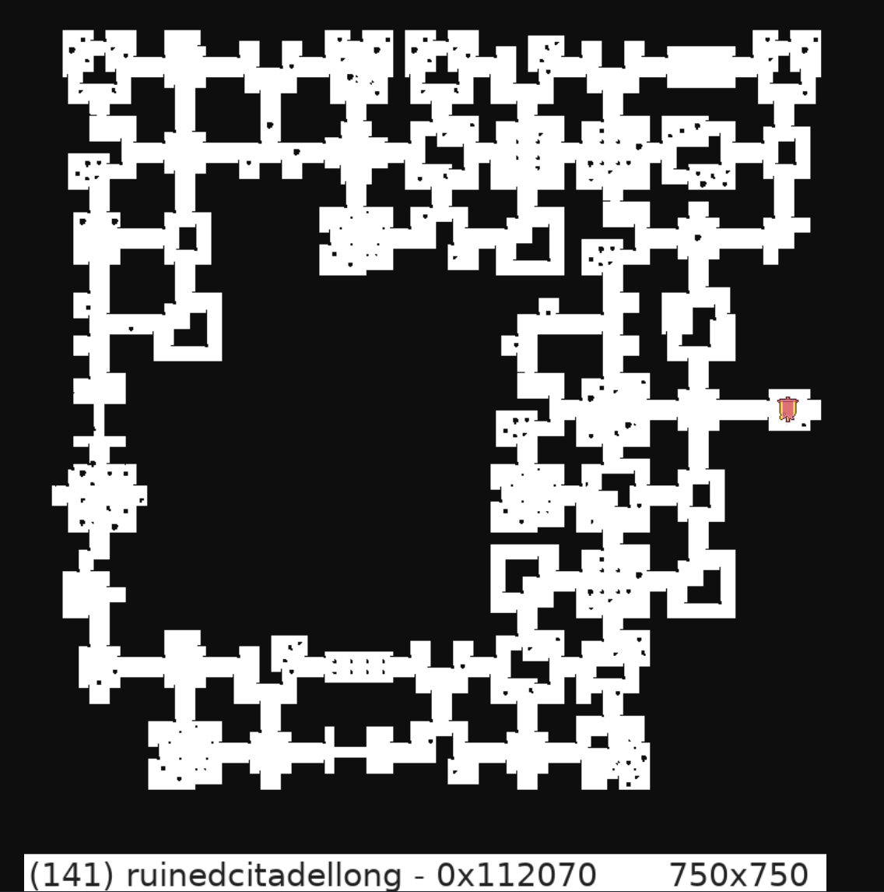

# PiMap - Diablo 2 - Map generation test

_This code is taken completly from Awesom-O_

A Linux based CLI interface to generate maps for diablo 2.


# Building

Using docker

```
sudo apt install libpcap-dev

yarn
yarn build-docker
docker build -t pimap .
```


# Generating maps

```
docker run -d -v /path/to/d2/game:/app/game -p 8899:8899 pimap

# /map/:seed/:difficulty/:levelCode.json
curl http://localhost:8899/map/1122416/Hell/141.json
```

## PNG export
```
# /map/:seed/:difficulty/:levelCode.json
wget http://localhost:8899/map/1122416/Hell/141.png
```
